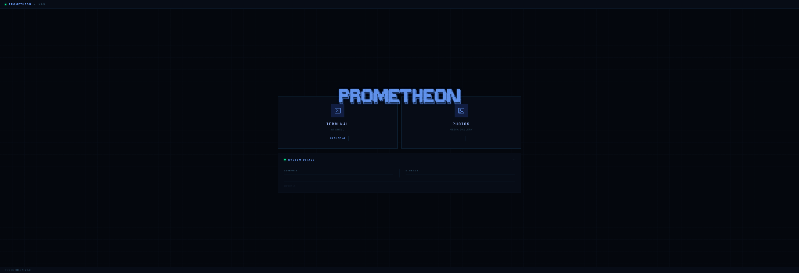
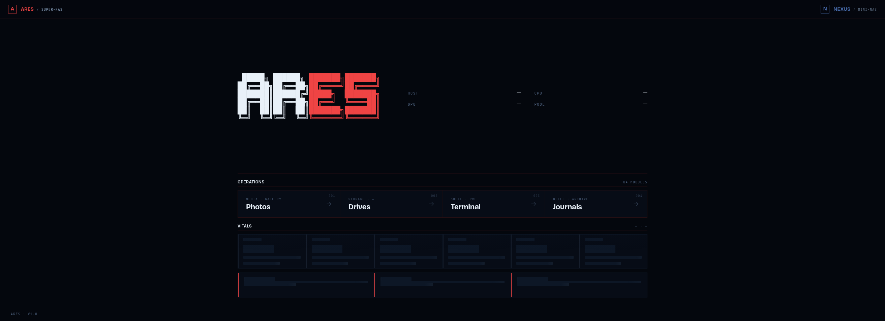
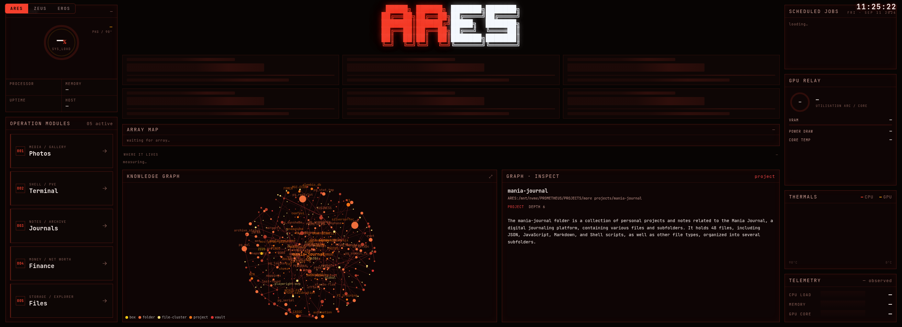
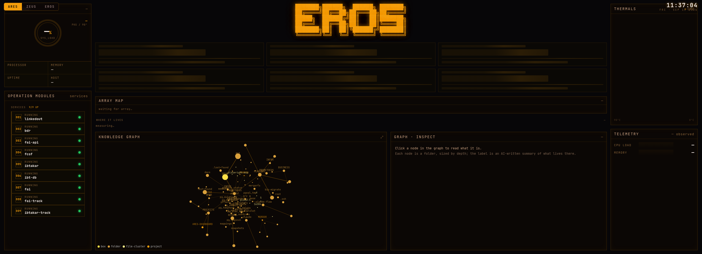
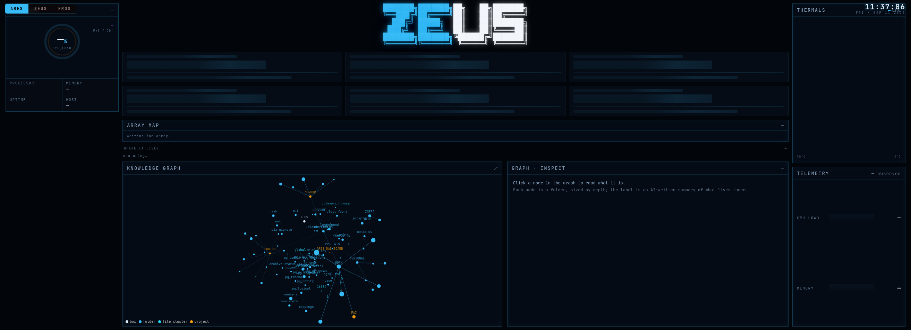

# PROMETHEON

Self-hosted **mission-control dashboards** for a three-machine homelab — **ARES**, **EROS**, and **ZEUS**.

One Flask app, three full-screen themed views (red / amber / blue). Each renders its own box: live
telemetry, GPU, storage, running services — and a traversable **3D knowledge graph** of what actually
lives on that machine, each node annotated with an AI-written description of the folder it represents.

---

## Evolution

It started as one box and a photo browser. Four versions later it's a three-machine mission-control
layer. These are the actual dashboards, rendered straight from their git history.

### V1 · `prometheon`
The origin: a single box running a **photo gallery**, a **web terminal**, and a **system-vitals** panel,
under a blue `PROMETHEON` wordmark. More app-launcher than dashboard.

### V3 · `ARES & NEXUS`
Two boxes. The main host became **ARES** (the "super-NAS"), with **NEXUS** as its mini-NAS peer. The
dashboard grew into the red **ARES** wordmark, a capability-gated layout shared across both machines,
**operation modules**, and a peer/sister-node panel showing the other box's health.

### V4 · `ARES · EROS · ZEUS`  *(current)*
Three machines. **NEXUS became ZEUS**, and a third box — **EROS** — joined. One template renders three
full-screen, per-box themed views (red / amber / blue), each pulling its own data, each with a
traversable knowledge graph. A switcher (top-left) and a live clock (top-right) tie them together.

**ARES** — the Proxmox host: dashboard, photo library, shared RTX 3080.

**EROS** — the worker: Ryzen + GTX 1070 running the business container stack (its "operation modules"
are the live containers, not apps).

**ZEUS** — the vault: a backup mule that wakes on a timer, pulls nightly copies of ARES + EROS, and
sleeps. Its view centers on the **combined** knowledge graph — the union of all three machines.

> The repo name (`ARES-HERMES`) and the pool path (`PROMETHEUS`) are fossils from earlier stops on that
> road. Same project, more machines.

---

## What's inside

- **One template, three brands.** `templates/home.html` renders per-box via `data-brand`; each box pulls
  its own data — ARES from its host APIs, EROS/ZEUS from a shared fleet snapshot — so no view ever shows
  another box's numbers.
- **Knowledge graph (MNEMOSYNE).** A stdlib-only Python indexer walks each box's filesystem to a bounded
  depth, fingerprints folders, and asks a local LLM (Ollama) to write a one-line "understanding" of each
  one — vault directories are name-only, never scanned. The result is a force-directed 3D graph you can
  spin, zoom, and click: pick a node to read its write-up in the inspector, or open fullscreen to
  focus-and-spotlight a subtree. A nightly job keeps it current, and an always-on MCP server exposes it
  to any agent session (`kg_search`, `kg_get`, `kg_neighbors`, `kg_tree`, `kg_stat`).
- **Fleet telemetry.** CPU / memory / load / thermals / GPU relay per box, plus a storage "where it
  lives" breakdown.
- **The apps behind the tiles.** A CLIP-searchable photo gallery with face clustering, a GoodNotes
  journal browser, a file explorer, and a web terminal — all behind session / bearer-token / WebAuthn
  auth, with an encrypted vault gate for private items.

## Stack

Flask (single-process, gunicorn) · SQLite (WAL) · Caddy (TLS + static serving) · open-clip / face
recognition for the gallery · Ollama for the graph's descriptions · Proxmox underneath it all. No
frontend framework — the graph and radars are hand-rolled `<canvas>`.

---

*A personal homelab project. Open-sourced as a reference for anyone building their own mission-control
layer over a home server.*
